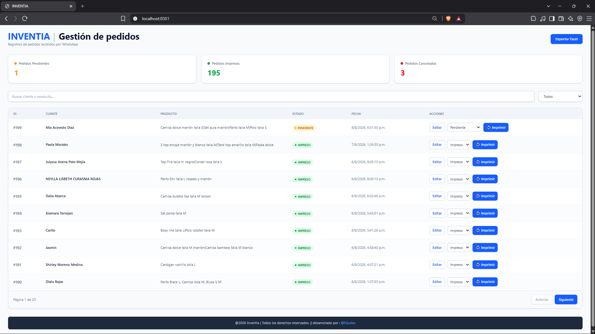
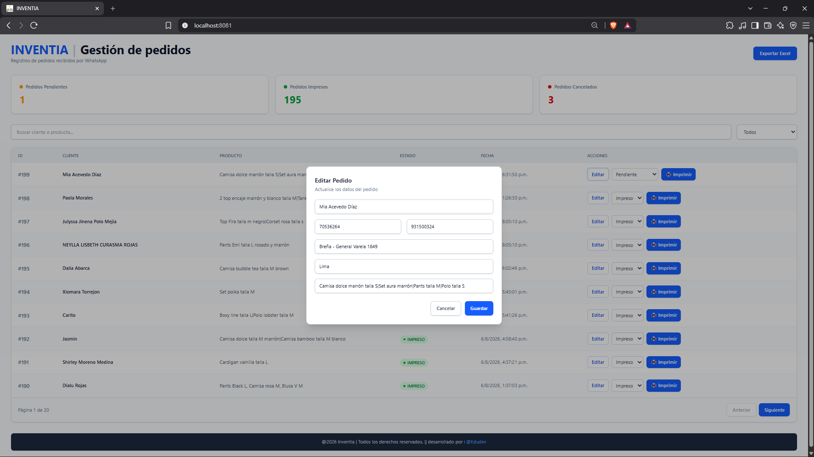
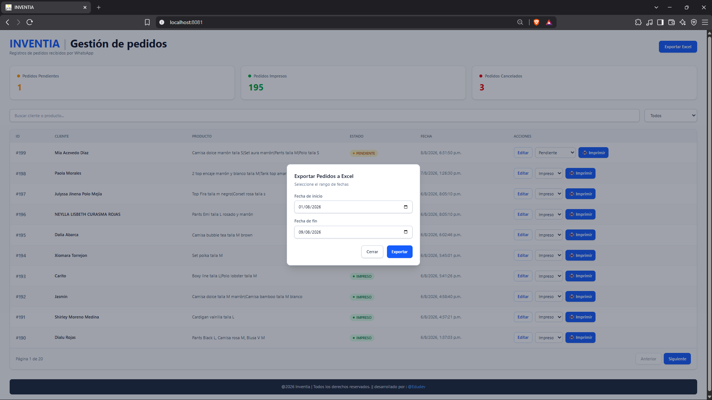

# INVENTIA ORDERS

> Automatización de pedidos recibidos por WhatsApp para centralizar su registro, gestión operativa, impresión y exportación.

Inventia Orders es un sistema fullstack que convierte la bandeja de WhatsApp en un canal de venta ordenado. Cada pedido que el cliente escribe como mensaje es detectado, normalizado y registrado automáticamente; luego se gestiona desde un dashboard web, se imprime como ticket PDF y se exporta a Excel por rango de fechas. Reemplaza las planillas manuales, reduce los errores de registro y da trazabilidad completa a cada pedido desde su llegada hasta su cierre.

## Problema que resuelve

- Los pedidos llegan mezclados con mensajes personales en WhatsApp y se pierden entre la conversación.
- El registro manual en cuadernos o Excel es propenso a errores, datos incompletos y duplicados.
- No hay visibilidad del estado de cada pedido (pendiente, impreso, cancelado).
- Reimprimir un ticket, localizar un pedido o cancelarlo con justificativo es lento y sin trazabilidad.
- Consolidar las ventas de un rango de fechas consume tiempo valioso.

Inventia Orders centraliza la recepción, normaliza los datos, asigna un estado a cada pedido y automatiza la impresión y la exportación.

## Beneficios

- **Captura automática:** cada pedido llega a la base de datos sin escribir a mano.
- **Deduplicación:** un mismo mensaje no se registra dos veces.
- **Control en tiempo real:** indicadores de pedidos pendientes, impresos y cancelados.
- **Tickets PDF con código de barras:** listos para imprimir.
- **Informes Excel por rango de fechas:** para análisis, caja y reportes.
- **Trazabilidad:** edición de datos y cancelación con motivo registrado.

## Caso de uso

Un negocio de venta por WhatsApp recibe el pedido de un cliente como mensaje de texto:

```text
CLIENTE: Juan Pérez
DNI: 12345678
TELEFONO: 999888777
DIRECCION: Av. Los Laureles 123
CIUDAD: Lima
- 2 Pizza familiar
- 1 Gaseosa 3L
```

El listener detecta el mensaje, lo envía a la API y el pedido aparece al instante en el dashboard como `PENDIENTE`. El operador lo revisa, puede editarlo si faltan datos, lo imprime como ticket y queda registrado como `IMPRESO`; también puede cancelarlo con un motivo si el cliente lo anula. Al cierre del día exporta el Excel del rango de fechas para su reporte.

## Capturas

### Dashboard principal



### Edición de pedido



### Exportación a Excel



### Listener de WhatsApp


### Ticket PDF


## Características principales

- Recepción de pedidos desde WhatsApp mediante Baileys.
- Sesión persistente con QR en terminal, reconexión automática y keep-alive del listener.
- Validación del formato de pedido y deduplicación mediante el identificador del mensaje de WhatsApp.
- Persistencia de clientes, datos de entrega, productos, estado, fechas y metadatos del chat en MySQL.
- Dashboard React con actualización periódica cada 3 segundos.
- Búsqueda por cliente o producto, filtros por estado y paginación de 10 pedidos por página.
- Indicadores para pedidos pendientes, impresos y cancelados.
- Edición de datos de pedido desde el dashboard.
- Cambio de estado y cancelación con motivo registrado.
- Generación y descarga de tickets PDF individuales con código de barras.
- Exportación de pedidos a Excel por rango de fechas.
- Pruebas de backend para la generación de Excel y los límites del rango de exportación.

## Arquitectura

```text
                         WhatsApp
                            |
                            v
               whatsapp/ (Node.js + Baileys)
               - QR y sesión persistente
               - Parseo y deduplicación de mensajes
                            |
                            | POST /api/pedidos
                            v
             api/ (Spring Boot 4.0.6, Java 17)
             - API REST y reglas de negocio
             - PDF / Excel
             - Recursos estáticos compilados
                  |                    |
                  v                    v
             MySQL                 pdfs/ locales
             tabla pedidos         tickets generados
                  ^
                  |
       admin-dashboard/ (React + Vite + Tailwind CSS)
       - Desarrollo del dashboard
       - Consulta la API en localhost:8081
```

El código fuente del dashboard vive en `admin-dashboard/`. El backend también sirve una compilación del frontend desde `api/src/main/resources/static/` al abrir `http://localhost:8081/`.

## Tecnologías

| Área | Tecnologías detectadas |
| --- | --- |
| Backend | Java 17, Spring Boot 4.0.6, Spring Data JPA, Hibernate, Lombok, MySQL Connector/J |
| Persistencia | MySQL |
| Frontend | React 19.2.6, React DOM 19.2.6, Vite 8.0.12, Tailwind CSS 4.3.0, Axios 1.16.0 |
| WhatsApp | Node.js (versión no fijada en el repositorio), Baileys 7.0.0-rc10, qrcode-terminal 0.12.0, Axios 1.16.0 |
| Documentos | OpenPDF 1.3.39, Apache POI OOXML 5.3.0 |
| Calidad | JUnit 5 y Mockito en las pruebas del backend |
| Build | Maven Wrapper 3.9.15, npm |

`ZXing 3.5.3` está declarado en el `pom.xml`, pero no tiene uso directo en el código actual. El código de barras del ticket se genera con `Barcode128` de OpenPDF.

## Dashboard Administrativo

El dashboard consume la API en `http://localhost:8081/api/pedidos` y ofrece:

- **Búsqueda:** filtra en el cliente y el texto de productos.
- **Filtros:** muestra todos los pedidos o filtra por `PENDIENTE`, `IMPRESO` y `CANCELADO`.
- **Paginación:** muestra 10 registros por página.
- **Indicadores:** cuenta pedidos pendientes, impresos y cancelados.
- **Edición:** permite actualizar cliente, DNI, teléfono, dirección, ciudad y productos.
- **Cambio de estado:** permite marcar pedidos pendientes como impresos o cancelarlos; los impresos también pueden cancelarse.
- **Cancelación:** exige un motivo y registra la fecha de cancelación.
- **Impresión:** descarga el ticket PDF de un pedido no cancelado y actualiza su estado de impresión.
- **Exportación Excel:** solicita un rango de fechas y descarga un archivo `.xlsx`.

La interfaz se actualiza por polling cada 3 segundos; no usa WebSockets.

## Automatización WhatsApp

El listener de `whatsapp/` procesa el flujo siguiente:

1. Inicia una sesión de WhatsApp Web con Baileys y muestra un QR en la terminal cuando es necesario.
2. Guarda la sesión en `whatsapp/auth/`, directorio ignorado por Git.
3. Escucha mensajes de texto convencionales, extendidos, efímeros y de visualización única compatibles con el parser.
4. Identifica pedidos que contienen como mínimo `CLIENTE:`, `DNI:`, `TELEFONO:` y `DIRECCION:`.
5. Extrae los campos del pedido; `CIUDAD:` es opcional y los productos multilínea se unen con `|`.
6. Adjunta el ID del mensaje, el chat de origen y la fecha original del mensaje.
7. Envía el pedido a `POST http://localhost:8081/api/pedidos`.
8. El backend rechaza duplicados cuando el `messageId` ya existe.

El listener intenta usar la versión más reciente de WhatsApp Web, se reconecta cinco segundos después de desconexiones no causadas por cierre de sesión y envía presencia cada minuto mientras está conectado.

## Generación PDF

La impresión individual disponible en el dashboard llama a `POST /api/pedidos/{id}/imprimir`.

El backend:

1. Cambia el pedido a `EN_PROCESO`.
2. Genera un ticket cuadrado en `pdfs/ticket_<timestamp>.pdf`.
3. Incluye cliente, teléfono, DNI, dirección, ciudad, productos, fecha, identificador de pedido y un código de barras `Barcode128` basado en el ID del pedido con nueve dígitos.
4. Limita la presentación del ticket a ocho productos para preservar el tamaño del formato.
5. Devuelve el PDF para descarga, marca el pedido como `IMPRESO` y registra `fechaImpresion`.

Los archivos de `pdfs/` contienen datos personales y están excluidos del repositorio.

## Exportación Excel

El dashboard solicita `GET /api/pedidos/exportar-excel?fechaInicio=YYYY-MM-DD&fechaFin=YYYY-MM-DD`.

- El rango se consulta por `fechaRegistro` e incluye ambos días seleccionados.
- Si no hay pedidos, la API responde `404`.
- El archivo se descarga como `pedidos_<inicio>_al_<fin>.xlsx`.
- La hoja `Pedidos` tiene 16 columnas, encabezados en negrita, autofiltro y primera fila congelada.
- Los datos disponibles incluyen fecha, cliente, DNI, celular, dirección, ciudad, productos, estado, motivo de cancelación y observaciones.
- Las columnas de total, medio de compra, método de pago, costo de envío, número de operación y envío/agencia se generan vacías porque esos valores no están modelados actualmente en la entidad `Pedido`.

## Instalación

### Requisitos

- Java 17.
- MySQL en ejecución.
- Node.js y npm para el dashboard y el listener. El repositorio no fija una versión de Node.js.

### 1. Clonar el repositorio

```bash
git clone https://github.com/EDU11QR/inventia-orders.git
cd inventia-orders
```

### 2. Configurar MySQL

Crear el archivo local de configuración a partir del ejemplo:

```bash
cp api/src/main/resources/application-example.yml api/src/main/resources/application.yml
```

Actualizar en `api/src/main/resources/application.yml` la URL JDBC, el usuario y la contraseña de MySQL. El ejemplo usa el puerto de aplicación `8081`.

### 3. Ejecutar el backend

macOS/Linux:

```bash
cd api
./mvnw spring-boot:run
```

Windows:

```bat
cd api
mvnw.cmd spring-boot:run
```

Con el backend iniciado, el dashboard compilado incluido en `api/src/main/resources/static/` se sirve en:

```text
http://localhost:8081/
```

Para ejecutar las pruebas del backend:

```bash
./mvnw test
```

> `api/iniciar-backend.bat` existe, pero solo ejecuta un JAR ya preparado y no compila el proyecto. Para un clon limpio, usa Maven Wrapper como se indica arriba.

### 4. Ejecutar el dashboard en desarrollo

En otra terminal:

```bash
cd admin-dashboard
npm ci
npm run dev
```

Para generar el build de Vite:

```bash
npm run build
```

El build se genera en `admin-dashboard/dist/`. Actualmente no hay un script que lo copie automáticamente a `api/src/main/resources/static/`; esa sincronización debe realizarse como parte del proceso de despliegue.

### 5. Ejecutar el listener de WhatsApp

En otra terminal:

```bash
cd whatsapp
npm ci
npm start
```

En el primer inicio, escanear el QR mostrado en la terminal. El script `whatsapp/iniciar-whatsapp.bat` ejecuta `node index.js` en Windows después de instalar dependencias.

## Configuración

| Elemento | Ubicación | Estado actual |
| --- | --- | --- |
| MySQL | `api/src/main/resources/application.yml` | Archivo local ignorado por Git; partir de `application-example.yml`. |
| Puerto API | `application.yml` | `8081` en el ejemplo. |
| URL del dashboard | `admin-dashboard/src/services/pedidoService.js` | Hardcodeada a `http://localhost:8081/api/pedidos`. |
| URL del listener | `whatsapp/index.js` | Hardcodeada a `http://localhost:8081/api/pedidos`. |
| Sesión WhatsApp | `whatsapp/auth/` | Generada por Baileys e ignorada por Git. No debe compartirse. |
| PDFs | `api/pdfs/` | Generados localmente e ignorados por Git. Contienen datos de pedidos. |

## Estructura del proyecto

```text
inventia-orders/
├── admin-dashboard/                    # Fuente del dashboard
│   ├── src/
│   │   ├── components/EditarPedidoModal.jsx
│   │   ├── pages/PedidosPage.jsx
│   │   └── services/pedidoService.js
│   ├── package.json
│   └── vite.config.js
├── api/                                # Backend Spring Boot
│   ├── src/main/java/com/edudev/pedidos_api/
│   │   ├── controller/
│   │   ├── dto/
│   │   ├── entity/
│   │   ├── repository/
│   │   └── service/
│   ├── src/main/resources/
│   │   ├── application-example.yml
│   │   └── static/                     # Build del dashboard servido por Spring
│   ├── src/test/
│   ├── pom.xml
│   └── mvnw
├── whatsapp/                           # Listener Baileys
│   ├── parsers/pedidoParser.js
│   ├── index.js
│   └── package.json
├── assets/                             # Capturas del README
│   ├── dashboard-v2.png
│   ├── editar-pedido.png
│   ├── exportar-excel.png
│   ├── listener.png
│   └── ticket.png
├── .gitignore
└── README.md
```

## Roadmap

Las siguientes son mejoras sugeridas; no representan funcionalidades ya implementadas:

- Configurar URLs, credenciales y puertos mediante variables de entorno.
- Añadir autenticación, autorización y una política CORS restrictiva para entornos productivos.
- Automatizar la publicación del build de `admin-dashboard/` dentro de los recursos estáticos del backend.
- Incorporar pruebas de interfaz y pruebas end-to-end del flujo completo.
- Agregar CI para ejecutar lint, pruebas y build en cada cambio.
- Versionar una licencia MIT y definir pautas de contribución.
- Mantener las capturas actualizadas conforme evolucione la interfaz.

## Autor

**EduDev**
Desarrollador Fullstack enfocado en automatización, sistemas comerciales y arquitectura escalable.

## Licencia

El repositorio no incluye actualmente un archivo de licencia. Se recomienda adoptar la [licencia MIT](https://opensource.org/license/mit/) antes de aceptar contribuciones o distribuir el proyecto.
