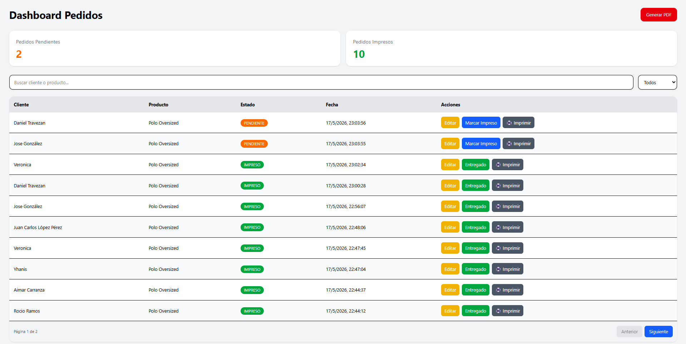
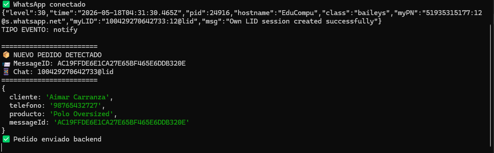
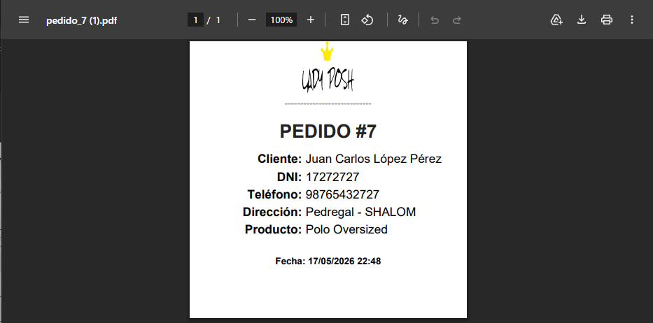

# INVENTIA ORDERS



Sistema fullstack de gestión de pedidos con automatización mediante WhatsApp, generación automática de etiquetas PDF y dashboard administrativo en tiempo real.

---

# Descripción

Inventia Orders es una solución desarrollada para automatizar la recepción y gestión de pedidos desde WhatsApp hacia un sistema administrativo centralizado.

El sistema procesa mensajes automáticamente, registra pedidos en base de datos, permite gestionar estados desde un dashboard visual y genera etiquetas PDF listas para impresión.

---

# Características Principales

* Recepción automática de pedidos desde WhatsApp
* Listener en tiempo real usando Baileys
* Dashboard administrativo integrado
* Generación automática de etiquetas PDF
* Gestión de estados de pedidos
* Descarga individual de tickets
* Persistencia en MySQL
* Arquitectura escalable y separada
* Automatización comercial real

---

# Arquitectura del Proyecto

```text
Inventia-orders/
│
├── api
│   ├── Backend Spring Boot
│   ├── Frontend integrado
│   └── Generación de PDFs
│
├── whatsapp
│   ├── Listener WhatsApp
│   ├── Parser de pedidos
│   └── Integración con backend
│
└── assets
```

---

# Tecnologías Utilizadas

## Backend

* Java v17
* Spring Boot v4.0.6
* Spring Data JPA
* Hibernate
* MySQL

## Frontend

* React
* Vite
* JavaScript
* CSS

## Automatización

* Node.js
* Baileys
* Axios
* qrcode-terminal

## PDF

* OpenPDF / iText

---

# Dashboard Administrativo

El sistema incluye un dashboard para:

* Visualizar pedidos en tiempo real
* Gestionar estados de pedidos
* Buscar clientes y productos
* Descargar tickets PDF
* Controlar pedidos pendientes e impresos


---

# Automatización WhatsApp

El listener desarrollado con Baileys permite:

* Escuchar mensajes automáticamente
* Procesar pedidos en tiempo real
* Detectar nuevos pedidos
* Enviar información directamente al backend
* Persistir pedidos automáticamente



---

# Etiquetas PDF

El sistema genera etiquetas individuales automáticamente para cada pedido.

## Características

* Diseño personalizado
* Información centrada
* Generación dinámica
* Descarga automática desde navegador



---

# Instalación

## 1. Clonar repositorio

```bash
git clone https://github.com/EDU11QR/inventia-orders.git
```

---

## 2. Backend

Entrar al proyecto:

```bash
cd api
```

Ejecutar:

```bash
./mvnw spring-boot:run
```

o usar:

```bash
iniciar-backend.bat
```

---

## 3. Listener WhatsApp

Entrar al proyecto:

```bash
cd whatsapp
```

Instalar dependencias:

```bash
npm install
```

Ejecutar:

```bash
node index.js
```

o usar:

```bash
iniciar-whatsapp.bat
```

---

# Base de Datos

Configurar MySQL desde:

```yaml
application.yml
```

---

# Objetivo del Proyecto

Este proyecto fue desarrollado como:

* Automatización comercial real
* Sistema fullstack escalable
* Proyecto profesional de portafolio
* Base para futuras integraciones comerciales

---

# Autor

## EduDev

Desarrollador Fullstack enfocado en automatización, sistemas comerciales y arquitectura escalable.

---

# Estado del Proyecto

Proyecto en evolución continua.
